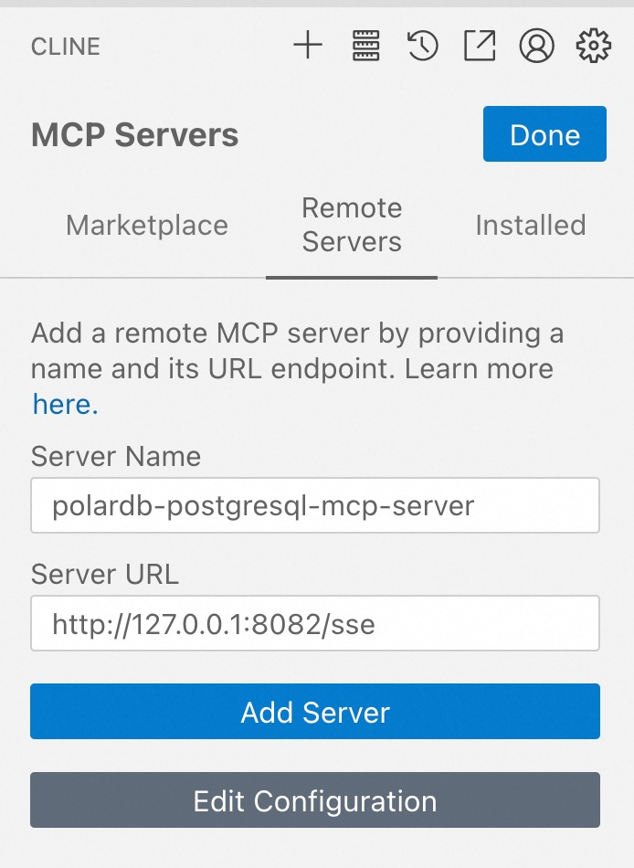

PolarDB MySQL MCP Server
=======================
# Prepare
1. install uv(if not exist)  
  curl -LsSf https://astral.sh/uv/install.sh | sh  
2. The project requires at least Python 3.10, if not available then install Python 3.12  
  uv python install 3.12  
# Environment Variables  
  The following environment variables are required to connect to PolarDB PostgreSQL database,environment Variables can be set in .env file  or set in command line  
* POLARDB_POSTGRESQL_HOST: Database host address  
* POLARDB_POSTGRESQL_PORT: Database port 
* POLARDB_POSTGRESQL_USER: Database user  
* POLARDB_POSTGRESQL_PASSWORD: Database password  
* POLARDB_POSTGRESQL_DBNAME: Database name  
* POLARDB_POSTGRESQL_ENABLE_UPDATE: Enable update operation(default:false)  
* POLARDB_POSTGRESQL_ENABLE_WRITE:  Enable write operation(default:false)  
* POLARDB_POSTGRESQL_ENABLE_INSER:  Enable insert operation(default:false)  
* POLARDB_POSTGRESQL_ENABLE_DDL:  Enable ddl operation(default:false)  
* SSE_BIND_HOST: The host address to bind for SSE mode  
* SSE_BIND_PORT: The port to bind for SSE mode  
<<<<<<< HEAD
* RUN_MODE: The run mode(sse|stdio),(default:stdio)  
# Build and Run
  git clone <git@gitlab.alibaba-inc.com>:rds_proxy/polardb_mcp_server.git  
  cd polardb_mcp_server/polardb-postgresql-mcp-server  
=======
* RUN_MODE: The run mode(sse|stdio),(default:sse)  
# Build and Run
  git clone https://github.com/aliyun/alibabacloud-polardb-mcp-server.git  
  cd alibabacloud-polardb-mcp-server/polardb-postgresql-mcp-server  
>>>>>>> ghub
  uv venv  
  source .venv/bin/activate  
  cp .env_example .env #set env file with your database information  
  uv run server.py
# Components
## Tools
* execute_sql: execute sql  
## Resources
* polardb-postgresql://schemas: List all schemas for PolarDB PostgreSQL in the current database  
## Resource Templates
* polardb-postgresql://{schema}/tables: List all tables for a schema 
* polardb-postgresql://{schema}/{table}/field: get the name,type and comment of the field in the table  
* polardb-postgresql://{schema}/{table}/data:  get data from the table,default limit 50 rows  
# Usage
## Cursor 
1. config for mcp.json
```json
{
  "mcpServers": {
    "polardb-postgresql-mcp-server": {
      "command": "uv",
      "args": [
        "--directory",
<<<<<<< HEAD
        "/xxxx/polardb_mcp_server/polardb-postgresql-mcp-server",
=======
        "/xxxx/alibabacloud-polardb-mcp-server/polardb-postgresql-mcp-server",
>>>>>>> ghub
        "run",
        "server.py"
      ],
      "env": {
        "POLARDB_POSTGRESQL_HOST": "127.0.0.1",
        "POLARDB_POSTGRESQ_PORT": "15001",
        "POLARDB_POSTGRESQ_USER": "xxxx",
        "POLARDB_POSTGRESQL_PASSWORD": "xxx",
        "POLARDB_POSTGRESQL_DBNAME": "xxx",
        "RUN_MODE": "stdio",
        "POLARDB_POSTGRESQL_ENABLE_UPDATE": "false",
        "POLARDB_POSTGRESQL_ENABLE_UPDATE": "false",
        "POLARDB_POSTGRESQL_ENABLE_INSER": "false",
        "POLARDB_POSTGRESQL_ENABLE_DDL": "false"
      }
    }
  }
}
```

## Client
1. set RUN_MODE=sse and other env variables in .env file  
<<<<<<< HEAD
2. cd polardb_mcp_server/polardb-postgresql-mcp-server && uv run server.py  
=======
2. cd alibabacloud-polardb-mcp-server/polardb-postgresql-mcp-server && uv run server.py  
>>>>>>> ghub
3. Set Remote Server  

